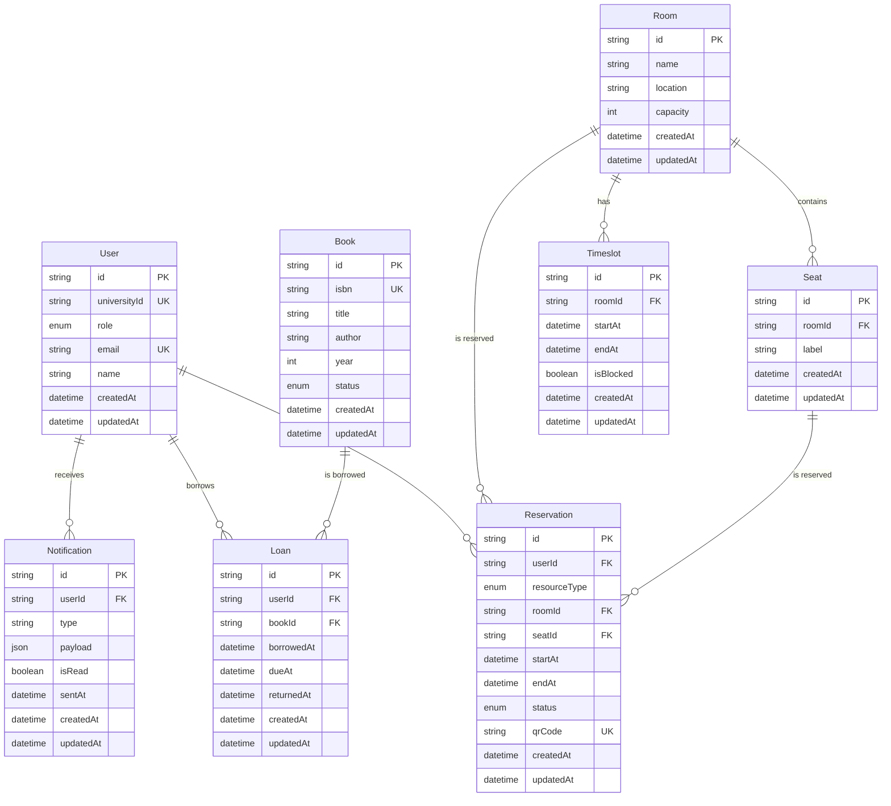

# Library Reservation System - Entity Relationship Diagram

This document provides a visual representation of the database schema for the Bahçeşehir University Library Reservation System.

## ER Diagram

## Schema Details

### Enums

- **Role**: `STUDENT`, `ADMIN`
- **ResourceType**: `ROOM`, `SEAT`
- **ReservationStatus**: `PENDING`, `APPROVED`, `CANCELLED`, `EXPIRED`, `CHECKED_IN`
- **BookStatus**: `AVAILABLE`, `ON_LOAN`, `RESERVED`

### Relationships

1. **User to Reservation**: One-to-many (A user can make multiple reservations)
2. **User to Loan**: One-to-many (A user can borrow multiple books)
3. **User to Notification**: One-to-many (A user can receive multiple notifications)
4. **Room to Seat**: One-to-many (A room can contain multiple seats)
5. **Room to Timeslot**: One-to-many (A room has multiple available timeslots)
6. **Room to Reservation**: One-to-many (A room can be reserved multiple times)
7. **Seat to Reservation**: One-to-many (A seat can be reserved multiple times)
8. **Book to Loan**: One-to-many (A book can be borrowed multiple times, but not simultaneously)

### Indexes

- Composite index on Reservation (roomId, startAt, endAt) for conflict checks
- Composite index on Reservation (seatId, startAt, endAt) for conflict checks
- Index on Book (title) for search functionality
- Index on Book (author) for search functionality
- Index on User (universityId) for quick lookups
- Index on Reservation (userId) for user's reservations
- Index on Loan (userId) for user's loans
- Index on Loan (bookId) for book's loan history
- Index on Notification (userId) for user's notifications

## Business Rules Implementation

1. **No overlapping reservations**: Enforced by composite indexes and application logic
2. **Daily & weekly booking limits**: Implemented in application logic
3. **QR code check-in**: Generated at booking, must be scanned within 15 min of start time
4. **Reservation time limits**: Default 1 hour, maximum 4 hours per day per user
